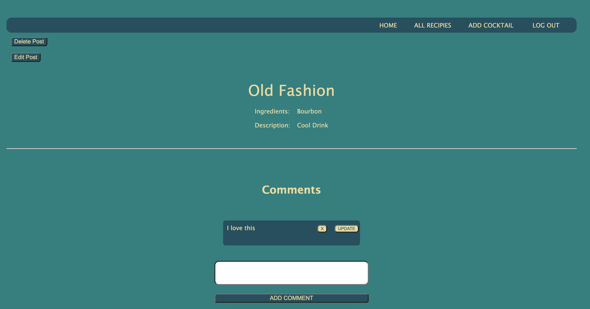

# Cocktail Club
A simple Post and comment forum where users can share their favorite cocktail recipies. 
Users can log in via google accounts, and post and comments will be logged into a database.

# Screenshot

# Planning 
[Click to go to Trello Planning](https://trello.com/b/CHbPilQr/project-2)

# Techologies Used
- Javascript
- HTML  
- CSS
- Express
- MongoDB
- Node JS

# Getting Started

[Click to go to Cocktail Club](https://cocktail-recipies.herokuapp.com/cocktails)

# Next Steps
- Users can favorite a cocktail and view it in favorites. 
- USers can search for a cocktail via a searchbar
- User can create cocktail posts with images. 